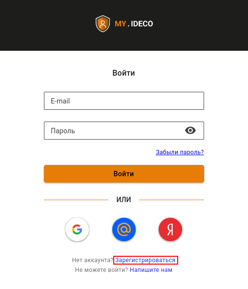
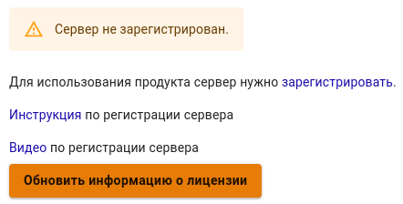

## Заголовок 1



Cсылка на [что-то еще](_index.md) 

## Заголовок 2

### Заголовок 3

> Первый уровень цитирования
>> Второй уровень цитирования
>>> Третий уровень цитирования
>
>Первый уровень цитирования



### Ненумерованный список

* Первый пункт;
* Второй пункт;
* Третий пункт.

### Нумерованный список

1\. Первый пункт;

2\. Второй пункт;

3\. Третий пункт.

**bold text**

*italicized text*

~~strikethrough text~~

This is a <sub>subscript</sub> text

This is a <sup>superscript</sup> text

```python
def say_hello():
    print("Hello!")
```

```python {filename="hello.py"}
def say_hello():
    print("Hello!")
```

```python {linenos=table,linenostart=1}
def say_hello():
    print("Hello!")
```

```python {linenos=table,hl_lines=[2,4],linenostart=1,filename="hello.py"}
def say_hello():
    print("Hello!")

def main():
    say_hello()
```

<mark style="background-color:red;">текст</mark>

<mark style="color:red;">текст</mark>

[<mark style="color:blue;">Google Chrome</mark>](https://support.google.com/chrome/answer/95582?hl=ru)

* [x] Межсетевой экран;
* [x] Система предотвращения вторжений;
* [x] Контент-фильтр.

---
title: "My Page with LaTeX"
math: true
---


### Default


  Hugo can be used to create a wide variety of websites, including blogs, portfolios, documentation sites, and more.


### Info


  Please visit GitHub to see the latest releases.


### Warning


  A **callout** is a short piece of text intended to attract attention.


### Error


  Something went wrong and it's going to explode.





{}

### Step 1

This is the first step.

### Step 2

This is the second step.

{}



  **JSON**: JavaScript Object Notation (JSON) is a standard text-based format for representing structured data based on JavaScript object syntax.
  **YAML**: YAML is a human-readable data serialization language.
  **TOML**: TOML aims to be a minimal configuration file format that's easy to read due to obvious semantics.





  
  ```json
  { "hello": "world" }
  ```
  

  ... add other tabs similarly




<details>
<summary>Раскрывашка старая</summary>
Привет
</details>


{}

Привет

{}

